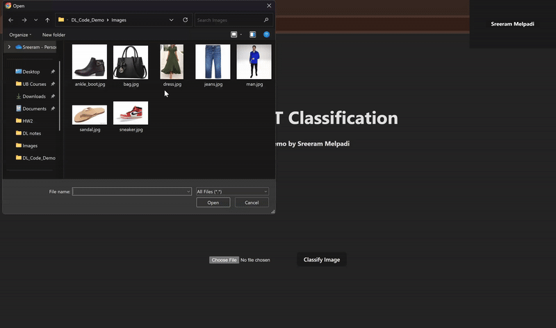

# Fashion MNIST Image Classifier Web App

## Project Overview

This project is an **End-End** Flask & React-based web application that provides an API for classifying images using a deep learning model trained on the Fashion MNIST dataset. The model predicts the category of fashion items (such as shirts, trousers, shoes, etc.) in images. It allows users to send an image via a POST request, and the server responds with the predicted category and top probabilities for the image.

The goal of this project is to deploy a simple yet effective image classification API powered by PyTorch, which can easily be deployed on cloud platforms like Heroku.



## Tech Stack

- **Flask**: For the backend server
- **PyTorch**: For the Deep learning Model
- **Gunicorn**: A WSGI HTTP Server for handling web requests in production used in Heroku.
- **ReactJS**: The Frontend is made using ReactJS for taking user input as image and classifies the fashion image.
- **ExpressJS**: The React App is deployed in ExpressJs Server
- **Vite**: Vite is used to build the React App. Used since create-react-app is deprecated.

---

## High Level Overview

- ⭐ Has a fronted web-app that collects user images and delivers the prediction
- ⭐ Talks to backend flask-app that reads, preprocesses and classifies the image
- ⭐ Frontend displays the top 3 prediction made along with the probabilities
- ⭐ Frontend and Backend Hosted in Heroku

---

## Deployment Guide: How to Deploy to Heroku

To deploy this project to Heroku, follow these steps:

### 1. Clone the repository

```bash
git clone https://github.com/sreerammelpadi/fashion-mnist-DL.git
```

### 2. Setup Heroku

You need to have a [Heroku](https://signup.heroku.com/) Account and install Heroku [CLI](https://devcenter.heroku.com/articles/heroku-cli).

I have used node to install heroku CLI in my system using:

```bash
npm install -g heroku
```

Then Login to heroku using:

```bash
heroku login
```

It'll redirect you to webpage which will help you login.

### 3. Create Heroku Apps

Create 2 Heroku apps. Change the name of the app to your liking.

```bash
heroku create fashion-mnist-frontend
heroku create fashion-mnist-backend
```

> Note: It might ask you to add a payment method.

This will create 2 heroku apps, and provides a remote heroku git repo for each app, something like:

https://git.heroku.com/fashion-mnist-backend.git

https://git.heroku.com/fashion-mnist-frontend.git

we need to add these as remotes.

### 4. Set up sub repositories
You may ask why do you need sub repositories when there's already the one we cloned.
The reason here is, we're going to be creating 2 heroku apps, one for frontend and one for backend,
and each of them requires a git repo for deploying the code to heroku.

You need 2 repositories for backend dir and frontend/fashionmnist/ dir.

Also add the remote links from previous section
```bash
cd backend/
git init
git branch -m main
git remote add heroku-backend <link to herokus backend git>
git add .
git commit -m "backend files"

cd ..

cd frontend/fashionmnist
git init
git branch -m main
git remote add heroku-backend <link to herokus frontend git>
git add .
git commit -m "frontend files"

```


### 5. Deploying to Heroku
Simply pushing the branch to the heroku remote will trigger a build and deploy your code to an instance.


#### First deploy the backend:

```bash
git push heroku-backend main
```

If everything is alright, your backend should now be live, and a URL for the server
would pop up something like:

https://appname.herokuapp.com/

Now update the endpoint in frontend/fashionmnist/src/App.jsx
to:

https://appname.herokuapp.com/classify


#### Deploy the Frontend:
Commit this change and deploy frontend


```bash
git add .
git commit -m "update endpoint"
git push heroku-frontend main
```

And again you should see the URL for your frontend.

Navigate to the URL and test the Model!

---

## Using the API

### `/classify` (POST request)

- **Endpoint**: `/classify`
- **Method**: `POST`
- **Parameters**: You need to upload an image with the field name `file` in the request.
- **Request Example**:

```bash
curl -X POST -F "file=@your_image.jpg" https://fashion-mnist-backend.herokuapp.com/classify
```

- **Response Example**:

```json
{
  "prediction": "T-shirt/top",
  "labels": ["T-shirt/top", "Pullover", "Dress"],
  "probabilities": ["87.92%", "9.10%", "2.98%"]
}
```

## Notes

- **Torch Version**: Due to Heroku's space constraints, the project uses a custom version of PyTorch and TorchVision optimized for CPU (`torch==2.0.0+cpu` and `torchvision==0.15.0+cpu`).
- **Model Size**: The trained model file is relatively small but may still require optimizations if Heroku’s 500MB limit is exceeded.

## Contributing

If you want to contribute to this project, feel free to fork the repository and submit a pull request. Please ensure that all contributions are well-documented and tested.
